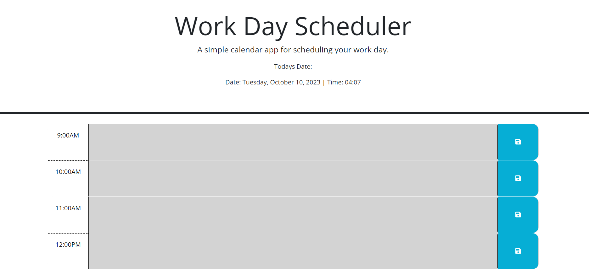

# Calendar-Application

## Description

I was given starter code for a workday calender application that I then went through and made modifications to. I first had to adjust my html so it would have enough time block for a typical work day of 9am-5pm. Then adjust my javascript so that the current date and time were displayed at the top and the time blocks were highlighted in a color corresponding to past, present, or future. I also allowed the user to add text notes to each time block and save it for future use.

## Usage

This will hopefully be used by white collar workers looking to keep track and organize their busy work schudule!

## Deployed URL for webpage

https://madiemalee.github.io/Calendar-Application/

## Webpage Output

